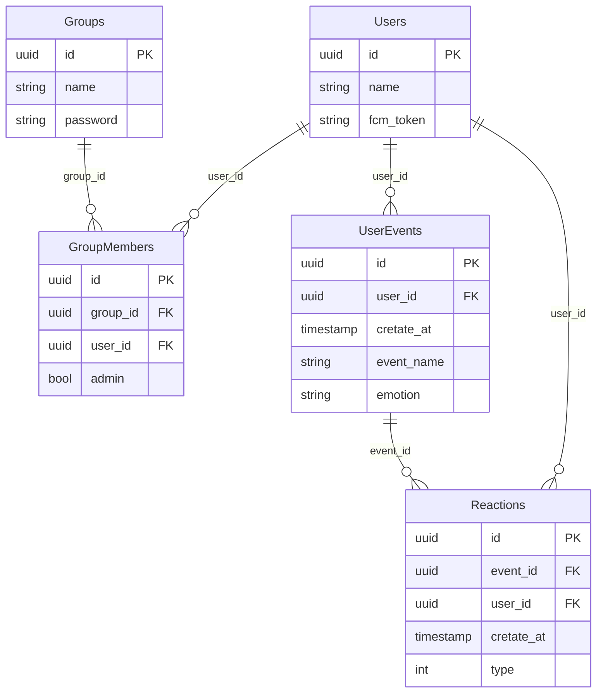

```mermaid
erDiagram
    Users ||--o{ GroupMembers : "user_id"
    Groups ||--o{ GroupMembers : "group_id"
    Users ||--o{ UserEvents : "user_id"
    UserEvents ||--o{ Reactions : "event_id"
    Users ||--o{ Reactions : "user_id"

    Users {
        uuid id PK
        string name
        string fcm_token
    }

    Groups {
        uuid id PK
        string name
        string password
    }

    GroupMembers {
        uuid id PK
        uuid group_id FK
        uuid user_id FK
        bool admin
    }

    UserEvents {
        uuid id PK
        uuid user_id FK
        timestamp cretate_at
        string event_name
        string emotion
    }

    Reactions{
		uuid id PK
        uuid event_id FK
        uuid user_id FK
        timestamp cretate_at
        int type　
    }
```
